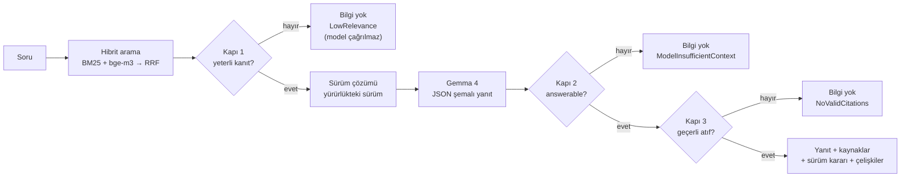

# SupportAssistant — AI destekli bilgi asistanı

Kurgu bir akıllı ev şirketinin (**Lumora Akıllı Ev**) müşteri destek ekibi için, Türkçe soruları **yalnızca bilgi
tabanındaki dokümanlardan** yanıtlayan bir .NET 10 API.

- Her yanıt; kullanılan **dokümanı, sürümünü, yürürlük tarihini, bölümünü** ve metinde gerçekten geçtiği doğrulanmış
  **alıntıyı** döndürür.
- Dokümanlarda yeterli bilgi yoksa yanıt **üretmez**, bunu açıkça belirtir ve nedenini (`refusalReason`) söyler.
- Aynı prosedürün eski ve yeni sürümü çeliştiğinde **yürürlükteki sürümü kodla seçer**, elenen sürümü gerekçesiyle
  gösterir. Farklı dokümanlar arasındaki çelişkiyi model bildirir, sunucu öncelik kuralına uyup uymadığını denetler.

**Değerlendirme:** 16/16 soru geçti (8 normal · 4 cevapsız · 4 çelişkili) — ayrıntı: [`eval/results/report.md`](eval/results/report.md)

---

## İçindekiler

1. [Hızlı başlangıç](#hızlı-başlangıç)
2. [API](#api)
3. [Nasıl çalışır](#nasıl-çalışır)
4. [Değerlendirme](#değerlendirme)
5. [Teknik tercihler](#teknik-tercihler)
6. [Bilinen sınırlar](#bilinen-sınırlar)
7. [Proje yapısı](#proje-yapısı)

---

## Hızlı başlangıç

### Gereksinimler

- **.NET 10 SDK** (`dotnet --version` → 10.0.x)
- **OpenAI-uyumlu bir sohbet modeli ucu** (`/v1/chat/completions`) ve önerilen olarak bir **embedding ucu**
  (`/v1/embeddings`). Geliştirme ve değerlendirmede kullanılan:
  - Sohbet: **Gemma 4 26B-A4B-it** (QAT, Q4) — llama.cpp `llama-server`
  - Embedding: **bge-m3** (Q8_0, 1024 boyut, çok dilli) — llama.cpp `llama-server`

### 1. Model sunucularını başlatın

llama.cpp ile (geliştirmede kullanılan kurulum):

```bash
# Sohbet modeli — port 1234 (--jinja: modelin chat şablonu; düşünme modu anahtarı bunu gerektirir)
./build/bin/llama-server -m gemma-4-26B-A4B-it-qat-UD-Q4_K_XL.gguf --host 0.0.0.0 --port 1234 --jinja -c 32768 -ngl 99

# Embedding modeli — port 1235
./build/bin/llama-server -m bge-m3-Q8_0.gguf --host 0.0.0.0 --port 1235 --embedding --pooling cls \
  -np 4 -c 32768 -b 8192 -ub 8192 -ngl 99
```

Alternatifler — kod değişmez, yalnızca `.env` değişir:

| Sağlayıcı | `Llm__BaseUrl` / `Embeddings__BaseUrl` | Not |
|---|---|---|
| LM Studio | `http://localhost:1234/v1` | *Developer → Start Server*; bir sohbet ve bir embedding modeli yükleyin |
| Ollama | `http://localhost:11434/v1` | ör. `ollama pull gemma3` · `ollama pull bge-m3` |
| OpenAI | `https://api.openai.com/v1` | `Llm__ApiKey`/`Embeddings__ApiKey` = kendi anahtarınız, `Embeddings__Model=text-embedding-3-small`, `Llm__EnableThinking` satırını silin |

Embedding ucu tanımlanmazsa (`Embeddings__BaseUrl=` boş) sistem **yalnızca BM25** ile çalışmaya devam eder.

### 2. Yapılandırın

```bash
cp .env.example .env     # URL'leri kendi sunucularınıza göre düzenleyin; .env git'e girmez
```

`.env` yalnızca Development ortamında (`dotnet run`) yüklenir; gerçek ortam değişkenleri her zaman önceliklidir.
Tüm ayarlar ve açıklamaları [`.env.example`](.env.example) içinde.

### 3. Çalıştırın

```bash
dotnet run --project src/API/SupportAssistant.API
```

- Açılışta `knowledge-base/` indekslenir. Log: `Knowledge base indexed: 10 documents, 53 sections, hybrid retrieval.`
- API arayüzü (Scalar): <http://localhost:5031/scalar> · OpenAPI: <http://localhost:5031/openapi/v1.json>
- Durum: <http://localhost:5031/v1/health> — indeks, dil modeli ve embedding yapılandırmasını gösterir.
- Veritabanı (`supportassistant.db`) türetilmiş veridir: silinirse açılışta yeniden oluşturulur.

### 4. Testler ve değerlendirme

```bash
dotnet test --solution SupportAssistant.slnx        # 134 test; model sunucusu gerekmez
dotnet run --project tools/SupportAssistant.Eval     # API çalışırken; rapor: eval/results/report.md
```

---

## API

Tüm uçlar `/v1` önekiyle ve standart `ApiResult<T>` zarfıyla (`success`, `message`, `data`, `statusCode`) yanıt verir.

| Metot | Yol | Açıklama |
|---|---|---|
| `POST` | `/v1/questions` | Soruyu dokümanlara dayanarak yanıtlar. Gövde: `{ "question": "..." }` (en fazla 500 karakter) |
| `GET` | `/v1/search?q=&topK=&mode=` | Dil modeli olmadan arama; bölümleri skorlarıyla gösterir. `mode=lexical` yalnızca BM25 |
| `GET` | `/v1/documents` | Dokümanlar ve sürüm bilgileri |
| `GET` | `/v1/documents/{id}` | Bir doküman ve bölümleri |
| `POST` | `/v1/documents/reindex` | `knowledge-base/` klasörünü yeniden okur; yalnızca değişen dokümanlar yeniden embed edilir |
| `GET` | `/v1/health` | İndeks / model / embedding durumu (`ok` veya `degraded`) |

**Durum kodları:** `200` yanıt veya açık "bilgi yok" · `400` geçersiz girdi · `404` doküman yok ·
`422` bilgi tabanı okunamadı · `502` model geçerli yapı üretemedi · `503` indeks hazır değil / modele ulaşılamıyor.

### Örnek 1 — Çelişkili sürümler: yürürlükteki sürüm seçilir

```bash
curl -s -X POST http://localhost:5031/v1/questions \
  -H "Content-Type: application/json" \
  -d '{"question": "Bir ürünü kaç gün içinde iade edebilirim?"}'
```

```json
{
  "success": true,
  "message": "OK",
  "data": {
    "question": "Bir ürünü kaç gün içinde iade edebilirim?",
    "answerable": true,
    "answer": "Ürünü, teslim aldığınız tarihten itibaren 30 gün içinde iade edebilirsiniz. Bu süre, kargo firmasının teslimat kaydındaki tarih esas alınarak hesaplanmaktadır.",
    "sources": [
      {
        "documentId": "iade-politikasi-v2",
        "title": "İade ve Para İadesi Politikası",
        "version": "2.0",
        "effectiveDate": "2025-06-01",
        "status": "active",
        "category": "politika",
        "section": "2. İade Süresi",
        "quote": "Müşteriler, ürünü teslim aldıkları tarihten itibaren 30 gün içinde iade talebinde bulunabilir. Süre, kargo firmasının teslimat kaydındaki tarih esas alınarak hesaplanır.",
        "quoteVerified": true
      }
    ],
    "versionResolution": {
      "applied": true,
      "rule": "Aynı doküman ailesinde, yürürlük tarihi bugün veya daha önce olan en yeni sürüm seçilir; 'superseded' işaretli sürüm seçilmez.",
      "selected": [{ "documentId": "iade-politikasi-v2", "title": "İade ve Para İadesi Politikası", "version": "2.0", "effectiveDate": "2025-06-01" }],
      "discarded": [{ "documentId": "iade-politikasi-v1", "title": "İade ve Para İadesi Politikası", "version": "1.0", "effectiveDate": "2024-01-15",
                      "reason": "2.0 sürümü (2025-06-01) tarafından geçersiz kılındı." }]
    },
    "conflicts": [],
    "missingInformation": "",
    "refusalReason": "",
    "diagnostics": {
      "retrievalMode": "hybrid",
      "maxDenseScore": 0.728,
      "maxLexicalCoverage": 0.667,
      "candidateDocumentIds": ["iade-politikasi-v2", "iade-politikasi-v1", "kargo-ve-teslimat", "garanti-kosullari", "sss-genel"],
      "context": [{ "label": "C1", "documentId": "iade-politikasi-v2", "version": "2.0", "section": "2. İade Süresi" }, "…7 bölüm daha"],
      "model": "gemma-4-26b-a4b-it",
      "latencyMs": 1335,
      "inputTokens": 1286,
      "outputTokens": 149
    }
  },
  "statusCode": 200
}
```

v1.0'daki "14 gün" kuralı arama sonuçlarında vardı, ama modele hiç gönderilmedi (`discarded`).

### Örnek 2 — Farklı dokümanlar arasında çelişki

`"İade kargo ücretini kim öder?"` sorusunda 2024 tarihli SSS "müşteri öder", 2025 tarihli İade Politikası v2.0
"ücretsiz" diyor. Yanıt politikayı kullanır; model çelişkiyi bildirir, sunucu öncelik kuralına uyduğunu doğrular:

```json
"answer": "İade kodunu kullanarak anlaşmalı kargo firmamızla gönderdiğiniz iadelerin kargo ücretini Lumora karşılamaktadır.",
"conflicts": [
  {
    "topic": "İade kargo ücreti",
    "chosen":   { "documentId": "iade-politikasi-v2", "version": "2.0", "effectiveDate": "2025-06-01", "category": "politika", "section": "5. İade Kargo Ücreti" },
    "rejected": [{ "documentId": "sss-genel", "version": "1.0", "effectiveDate": "2024-02-01", "category": "sss", "section": "İade > İade kargo ücretini kim öder?" }],
    "reason": "C2 (Politika, sürüm 2.0, 2025-06-01) ile C1 (SSS, sürüm 1.0, 2024-02-01) arasında çelişki bulunmaktadır. Politika dokümanı SSS'den daha önceliklidir ve daha yeni bir yürürlük tarihine sahiptir.",
    "ruleSatisfied": true
  }
]
```

### Örnek 3 — Dokümanlarda bilgi yok

```bash
curl -s -X POST http://localhost:5031/v1/questions \
  -H "Content-Type: application/json" \
  -d '{"question": "Ürünlerinizi yurt dışına gönderiyor musunuz?"}'
```

```json
{
  "success": true,
  "message": "Bu soruyu yanıtlamak için dokümanlarda yeterli bilgi bulunamadı.",
  "data": {
    "question": "Ürünlerinizi yurt dışına gönderiyor musunuz?",
    "answerable": false,
    "answer": "Bu soruyu yanıtlamak için dokümanlarda yeterli bilgi bulunamadı.",
    "sources": [],
    "versionResolution": { "applied": false, "rule": "…", "selected": [], "discarded": [] },
    "conflicts": [],
    "missingInformation": "",
    "refusalReason": "LowRelevance",
    "diagnostics": { "retrievalMode": "hybrid", "maxDenseScore": 0.456, "maxLexicalCoverage": 0.312, "context": [], "model": "", "latencyMs": 14 }
  },
  "statusCode": 200
}
```

Arama yeterli kanıt bulamadığı için dil modeli **hiç çağrılmadı** (14 ms). Alana yakın sorularda (ör. "HomeKit ile
kullanabilir miyim?") retlerin nedeni `ModelInsufficientContext`'tir. Bu durumda `missingInformation` alanında
modelin neyin eksik olduğunu açıklaması yer alır.

---

## Nasıl çalışır



### Mimari

Mevcut CQRS modüler monolit iskeletim üzerine tek bir `Knowledge` modülü eklendi:

`Endpoint (FastEndpoints) → IKnowledgeService → MediatR komut/sorgu → Handler → BusinessRules → Repository / Port`

- **Domain:** `KnowledgeDocument` (bir doküman sürümü), `DocumentChunk` (bölüm + embedding), `QuestionLog` (denetim kaydı).
- **Application:** `AskQuestionCommand`, `IngestKnowledgeBaseCommand`, `SearchKnowledgeQuery`, doküman sorguları,
  `KnowledgeBusinessRules`. Cevaplama politikaları saf ve test edilebilir sınıflardır: `VersionResolver`,
  `AnswerabilityPolicy`, `CitationValidator`, `SourcePrecedence`. LLM ve embedding, Application'ın kendi portları
  arkasındadır (`IGroundedAnswerGenerator`, `ITextEmbedder`, `IKnowledgeIndex`).
- **Infrastructure:** EF Core + SQLite, markdown ingest, bellek içi hibrit indeks, `Microsoft.Extensions.AI` +
  OpenAI SDK adaptörleri.
- Katman kuralları (ör. Application, EF Core veya OpenAI SDK'sını tanıyamaz) `NetArchTest` testleriyle zorunlu.

`ask` bir *command* olarak modellendi: dış modele maliyetli bir çağrı yapar ve `question_logs` tablosuna denetim kaydı yazar.

### Bilgi tabanı (`knowledge-base/`)

Her dosya YAML front matter ile başlar
(`id, documentKey, title, version, effectiveDate, status, supersedes, category`). Aynı prosedürün sürümleri aynı
`documentKey`'i paylaşır.

| Doküman | Tür | Sürüm / yürürlük | Not |
|---|---|---|---|
| `iade-politikasi-v1` · `-v2` | politika | 1.0 (2024-01-15, superseded) · 2.0 (2025-06-01) | 14 → 30 gün; kargo müşteriden → ücretsiz; para iadesi 10 → 5 iş günü |
| `destek-kanallari-v1` · `-v2` | politika | 1.0 (2024-03-01, superseded) · 2.0 (2025-09-01) | hafta içi 09–18 → 7/24 canlı sohbet |
| `garanti-kosullari` | politika | 1.0 (2025-01-10) | 2 yıl, kapsam dışı durumlar |
| `kargo-ve-teslimat` | politika | 1.0 (2025-03-01) | süreler, 750 TL ücretsiz kargo eşiği |
| `kurulum-kilavuzu-lumora-termo` | kılavuz | 1.0 (2025-02-01) | 2.4 GHz Wi-Fi, fabrika ayarı |
| `sorun-giderme-baglanti` | kılavuz | 1.0 (2025-04-15) | LED renkleri, hata kodları |
| `sikayet-eskalasyon-proseduru` | prosedür | 1.0 (2025-05-01) | ekip içi L1/L2/L3 |
| `sss-genel` | SSS | 1.0 (2024-02-01) | eski "iade kargosunu müşteri öder" bilgisi (kaynaklar arası çelişki) |

Her başlık (`##`/`###`) bir bölümdür (toplam 53). Atıflarda bölüm yolu görünür, ör. `2. Destek Seviyeleri > 2.2 Seviye 2 (L2)`.

### Arama

- **Türkçe normalizasyon:** `tr-TR` küçük harf ve ç/ğ/ı/ö/ş/ü katlama. "iade suresi kac gun" ile
  "İade süresi kaç gün?" aynı terimlere iner.
- **BM25:** Türkçe stopword'ler ve 5 harflik önek kökleme (F5; Türkçe bilgi erişimi çalışmalarında morfolojik
  çözümlemeye yakın sonuç veren basit bir yöntem). Bölüm başlığı ve doküman başlığı da aranır.
- **Vektör:** bge-m3 embedding'leri ingest sırasında hesaplanır ve SQLite'ta saklanır. İçerik hash'i değişmeyen
  doküman yeniden embed edilmez.
- **Birleşim:** Reciprocal Rank Fusion (k=60). BM25 skorlarıyla kosinüs skorları farklı ölçeklerde olduğu için sıralama
  birleştirilir. Modele ilk **8** bölüm verilir.
- Embedding ucuna ulaşılamazsa uygulama açılır ve BM25 moduna düşer; bir sonraki `reindex` eksik vektörleri tamamlar.

### "Bilgi yok" politikası — üç kapı

| Kapı | Nerede | Ne zaman reddeder |
|---|---|---|
| 1 · Arama kanıtı | `AnswerabilityPolicy` | En iyi kosinüs < 0,55 **ve** kelime kapsamı < 0,5. İkisinden biri yeter: vektör parafrazı yakalar, kelime kapsamı bge-m3'ün zayıf kaldığı Türkçe karaktersiz yazımı yakalar. Model çağrılmaz. |
| 2 · Model kararı | JSON şemasındaki `answerable` | Kaynaklar soruyu yanıtlamıyorsa model `answerable=false` ve `missingInformation` döndürür. |
| 3 · Atıf doğrulama | `CitationValidator` | Yanıt, modele verilen bölümlerden hiçbirine atıf yapmıyorsa. Alıntının bölüm metninde geçip geçmediği ayrıca `quoteVerified` ile gösterilir. |

Model yanıtı **JSON şemasıyla kısıtlıdır**. llama.cpp şemayı bir grammar'a çevirdiği için çıktı her zaman ayrıştırılır;
yine de geçersiz gelirse bir kez yeniden denenir, ikincisinde `502` döner. Modele ulaşılamazsa `503` döner. Bu iki
durum "bilgi yok" diye geçiştirilmez.

### Çelişki çözümü

1. **Aynı dokümanın sürümleri (deterministik).** `VersionResolver` arama adaylarını `documentKey`'e göre gruplar ve
   yürürlük tarihi bugün veya öncesi olan, `superseded` olmayan en yeni sürümü seçer. Tarih eşitse yüksek sürüm
   numarası kazanır; ileri tarihli sürüm henüz yürürlükte sayılmaz. Eski sürümün bölümleri **modele gönderilmez**;
   yanıtta `versionResolution.discarded` altında gerekçesiyle listelenir. Soruya yalnızca eski sürüm eşleştiyse,
   güncel sürümün soruya en yakın bölümleri onun yerine konur.
2. **Farklı dokümanlar (model + sunucu denetimi).** Prompt'taki öncelik kuralı: politika/prosedür > kılavuz > SSS;
   aynı türde yürürlük tarihi daha yeni olan geçerlidir. Model çelişkiyi `conflicts` alanına yazar, sunucu seçimin bu
   kurala uyup uymadığını hesaplayıp `ruleSatisfied` olarak ekler.

Sürüm kararları yalnızca yanıtın atıf yaptığı doküman aileleri için raporlanır. Retlerde boş döner; arama ve bağlam
ayrıntısı `diagnostics` altındadır.

---

## Değerlendirme

[`eval/questions.json`](eval/questions.json) içinde **16 soru** var: 8 normal (biri parafraz, biri iki dokümana
yayılan soru), 4 cevapsız ve 4 çelişkili. Her sorunun insanın okuyacağı bir **beklenen yanıtı** ve deterministik
kontrolleri vardır:

- yanıtlanabilirlik
- beklenen ve yasak kaynaklar
- içerik ifadeleri (Türkçe karakterden bağımsız, kelime başında eşleşir)
- yasak ifadeler (ör. "14 gün")
- elenmesi gereken sürümler

[`tools/SupportAssistant.Eval`](tools/SupportAssistant.Eval) soruları çalışan API'ye sorar ve
[`eval/results/report.md`](eval/results/report.md) dosyasına **beklenen ile gerçek** karşılaştırmasını, ham sonuçları da
`results.json` dosyasına yazar.

| Çalıştırma | Sonuç | Medyan yanıt süresi | Arama isabeti: yalnız BM25 / hibrit |
|---|---|---|---|
| Varsayılan — düşünme modu kapalı ([rapor](eval/results/report.md)) | **16/16** | 1,4 sn | 10/12 / **12/12** |
| Düşünme modu açık ([rapor](eval/results/thinking-on/report.md)) | 16/16 | 9,8 sn | 10/12 / 12/12 |

Bulgular:

- **Hibrit aramanın katkısı ölçülebilir.** "Paramı ne zaman geri alırım?" (N08) sorusunda "iade" kelimesi geçmiyor.
  "Para İadesi" bölümünü yalnızca vektör arama buluyor; BM25 tek başına iki soruda beklenen kaynağı kaçırıyor.
- **Düşünme modu bu sette doğruluğu artırmadı, gecikmeyi ~7 kat yükseltti.** Soru başına üretilen token sayısı
  58–273'ten 654–2618'e çıkıyor. Bu yüzden varsayılan kapalı.
- **Kapı 1 eşiği veriyle seçildi.** Yanıtlanabilir sorularda en düşük kosinüs 0,60; Kapı 1'de reddedilen sorularda
  0,45–0,46. Alana yakın cevapsız sorular (garanti uzatma paketi, HomeKit: 0,61–0,62) benzerlikle ayrılamıyor. Bunları
  Kapı 2'de model doğru şekilde reddediyor.
- **Kalibrasyon geçmişi (şeffaflık için).** İlk koşu 13/15'ti, iki düzeltme yapıldı:
  - `TopK` 6 → 8: iki konulu N07'de teslimat bölümü 8. sıradaydı.
  - Prompt kuralı: model kuralı bildiği halde müşterinin özel durumunu bilmediği için reddediyordu (N03).

  Bir de değerlendirme bakımı yapıldı: C04'ün doğru yanıtı "Lumora **karşılamaktadır**" dediği için "Lumora karşılar"
  ifade kontrolü kök biçimine ("Lumora karşıla") genişletildi. Soruları yazan, dokümanları da yazan kişi olduğundan
  set küçük ve iyimser bir ölçüttür (bkz. sınırlar).
- Gecikme notu: değerlendirme uzak, tek slotlu ve paylaşılan bir sunucuda koştu. İlk istek (ısınma) veya o anki yük
  tek soruları 15–35 sn'ye çıkarabiliyor; raporda bu yüzden medyan da veriliyor.

Yeniden üretmek için: API'yi çalıştırın → `dotnet run --project tools/SupportAssistant.Eval`
(`--label ad` başka bir klasöre yazar, `--base-url` farklı adres).

---

## Teknik tercihler

| Karar | Gerekçe | Reddedilen alternatif |
|---|---|---|
| Yalnızca .NET, mevcut CQRS modüler monolit | Tek runtime, tutarlı katmanlar, 3 günlük süre | .NET + FastAPI (iki dil, iki kat kurulum ve test) |
| `Microsoft.Extensions.AI` + OpenAI SDK, OpenAI-uyumlu uç | Sağlayıcı yapılandırmayla değişir (llama.cpp, LM Studio, Ollama, OpenAI, Gemini) | Tek sağlayıcının SDK'sına bağlanmak |
| Yerel Gemma 4 (llama.cpp) | Anahtar ve maliyet yok, veri dışarı çıkmaz, Türkçesi yeterli, ~200 token/sn | Bulut LLM (kod hazır, yalnızca `.env`) |
| Hibrit arama: BM25 + bge-m3, RRF | Eş anlamlı ve parafraz sorular + kesin terim ve sayılar; ölçülen katkı 10/12 → 12/12 | Yalnız vektör (sayı/kod kaçırır), yalnız BM25 |
| Bellek içi indeks, SQLite + EF Core | ~50 bölüm için kaba kuvvet aramanın maliyeti ihmal edilebilir; mevcut altyapı | Qdrant / pgvector / sqlite-vec (bu ölçekte gereksiz işletim yükü) |
| Sürüm çelişkisini kod çözer | Açıklanabilir, test edilebilir; eski kural modele hiç ulaşmaz | Kararı yalnızca prompt'a bırakmak |
| Üç kapılı "bilgi yok" | Ucuz ön eleme + model kararı + atıf doğrulaması | Yalnızca "bilmiyorsan söyle" talimatı |
| JSON şemalı çıktı, kısa bölüm kimlikleri `[C1…]` | Ayrıştırma garantili; uydurma kimlik riski düşük | Serbest metin + regex |
| Deterministik değerlendirme + arama isabeti | Tekrarlanabilir; hatanın aramada mı üretimde mi olduğu ayrılır | LLM-as-judge (aynı modelle zayıf, tekrarlanamaz) |
| FastEndpoints 8, MediatR 14, EF Core 10.0.12 | Son kararlı sürümler; `Directory.Packages.props` ile merkezi yönetim | — |
| Shouldly, xunit.v3 (Microsoft.Testing.Platform) | FluentAssertions 8 ticari lisanslı | FluentAssertions |

Not: MediatR 13'ten itibaren ticari lisans modeline geçti. Anahtar olmadan çalışır, yalnızca açılışta uyarı loglar
(`MEDIATR_LICENSE_KEY`). Lisans istenmiyorsa MIT lisanslı `Mediator` (source generator) ile değiştirilebilir.

---

## Bilinen sınırlar

- **Küçük ve iyimser değerlendirme:** 16 soru; sorular ve dokümanlar aynı kişi tarafından yazıldı. Eşikler bu setle
  kalibre edildi, yeni sorularda aşırı uyum riski var.
- **Kaynaklar arası çelişki modele bağlı:** kural prompt'ta, denetim sunucuda (`ruleSatisfied`) ama garanti yok.
  Aynı doküman ailesindeki sürüm çelişkisi ise deterministik.
- **Türkçe morfoloji:** F5 önek kökleme basit bir yöntem; tam morfolojik çözümleme (ör. Zemberek) yok.
  bge-m3 Türkçe karaktersiz yazımda zayıf; bu açığı BM25 tarafındaki harf katlama kapatıyor.
- **Tarihsel soru yok:** "2024'te iade süresi neydi?" gibi sorularda da her zaman yürürlükteki sürüm kullanılır.
- **Çok parçalı sorular:** iki ayrı konu soran sorularda ikinci konu aramada geride kalabilir. `TopK=8` bu setteki
  örneği çözüyor; genel çözüm soru ayrıştırma (query decomposition) olurdu.
- **Ölçek:** bellek içi indeks ve kaba kuvvet arama küçük korpus içindir. Büyüdüğünde `IKnowledgeIndex` arkasında
  FTS5, pgvector veya Qdrant'a geçilir. Tek slotlu yerel model eşzamanlı istekleri sıraya koyar.
- **Kapsam dışı:** kimlik doğrulama yok (`POST /v1/documents/reindex` dahil; üretimde yönetici yetkisi gerekir),
  çok turlu sohbet yok, yalnızca markdown ingest. Şema değişirse `supportassistant.db` silinip yeniden oluşturulur
  (veri türetilmiş).

---

## Proje yapısı

```
SupportAssistant.slnx                       .NET 10 solution (slnx)
Directory.Build.props · Directory.Packages.props · global.json
.env.example                                 örnek ortam değişkenleri
knowledge-base/                              10 kurgu doküman (markdown + YAML front matter)
eval/questions.json                          16 değerlendirme sorusu
eval/results/                                report.md (beklenen ↔ gerçek), results.json, thinking-on/
src/API/SupportAssistant.API                 FastEndpoints uçları, DI, Program.cs
src/Modules/Knowledge/Knowledge.Domain        varlıklar, repository arayüzleri
src/Modules/Knowledge/Knowledge.Application   komut/sorgu, iş kuralları, cevaplama politikaları, portlar
src/Modules/Knowledge/Knowledge.Infrastructure EF Core, ingest, arama indeksi, LLM/embedding adaptörleri
src/Services/Knowledge/Knowledge.Service      IKnowledgeService (MediatR facade)
src/Shared/Shared.{Kernel,Application,Infrastructure}
tests/SupportAssistant.UnitTests             birim + mimari testleri
tests/SupportAssistant.IntegrationTests      API testleri (in-process, sahte LLM, geçici SQLite)
tools/SupportAssistant.Eval                  değerlendirme aracı
agent.md                                     kodlama ajanları için mimari kurallar
```
