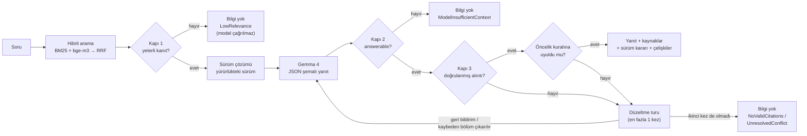

# SupportAssistant — AI destekli bilgi asistanı

Kurgu bir akıllı ev şirketinin (**Lumora Akıllı Ev**) müşteri destek ekibi için, Türkçe soruları **yalnızca bilgi
tabanındaki dokümanlardan** yanıtlayan bir .NET 10 API.

- Her yanıt; kullanılan **dokümanı, sürümünü, yürürlük tarihini, bölümünü** ve metinde gerçekten geçtiği doğrulanmış
  **alıntıyı** döndürür. Alıntısı bölüm metninde doğrulanamayan atıf yanıtın dayanağı olamaz.
- Dokümanlarda yeterli bilgi yoksa yanıt **üretmez**, bunu açıkça belirtir ve nedenini (`refusalReason`) söyler.
- Aynı prosedürün eski ve yeni sürümü çeliştiğinde **yürürlükteki sürümü kodla seçer**, elenen sürümü gerekçesiyle
  gösterir. Farklı dokümanlar arasındaki çelişkiyi model bildirir; sunucu öncelik kuralını denetler ve model kuralı
  çiğnerse **kaybeden kaynağı bağlamdan çıkarıp yanıtı yeniden üretir**.

**Değerlendirme:** kalibrasyon setinde 16/16 (8 normal · 4 cevapsız · 4 çelişkili,
[rapor](eval/results/report.md)); ayar için hiç kullanılmamış bağımsız 12 soruluk sette 10/12
([rapor](eval/results/holdout/report.md), kalan iki soru [aşağıda](#bağımsız-set) açıklanıyor).

---

## İçindekiler

1. [Hızlı başlangıç](#hızlı-başlangıç)
2. [API](#api)
3. [Nasıl çalışır](#nasıl-çalışır)
4. [Değerlendirme](#değerlendirme)
5. [Teknik tercihler](#teknik-tercihler)
6. [Bilinen sınırlar](#bilinen-sınırlar)
7. [Proje yapısı](#proje-yapısı)

---

## Hızlı başlangıç

### Gereksinimler

- **.NET 10 SDK** (`dotnet --version` → 10.0.x)
- **OpenAI-uyumlu bir sohbet modeli ucu** (`/v1/chat/completions`) ve önerilen olarak bir **embedding ucu**
  (`/v1/embeddings`). Geliştirme ve değerlendirmede kullanılan:
  - Sohbet: **Gemma 4 26B-A4B-it** (QAT, Q4) — llama.cpp `llama-server`
  - Embedding: **bge-m3** (Q8_0, 1024 boyut, çok dilli) — llama.cpp `llama-server`

### 1. Model sunucularını başlatın

llama.cpp ile (geliştirmede kullanılan kurulum):

```bash
# Sohbet modeli — port 1234 (--jinja: modelin chat şablonu; düşünme modu anahtarı bunu gerektirir)
./build/bin/llama-server -m gemma-4-26B-A4B-it-qat-UD-Q4_K_XL.gguf --host 0.0.0.0 --port 1234 --jinja -c 32768 -ngl 99

# Embedding modeli — port 1235
./build/bin/llama-server -m bge-m3-Q8_0.gguf --host 0.0.0.0 --port 1235 --embedding --pooling cls \
  -np 4 -c 32768 -b 8192 -ub 8192 -ngl 99
```

Alternatifler — kod değişmez, yalnızca `.env` değişir:

| Sağlayıcı | `Llm__BaseUrl` / `Embeddings__BaseUrl` | Not |
|---|---|---|
| LM Studio | `http://localhost:1234/v1` | *Developer → Start Server*; bir sohbet ve bir embedding modeli yükleyin |
| Ollama | `http://localhost:11434/v1` | ör. `ollama pull gemma3` · `ollama pull bge-m3` |
| OpenAI | `https://api.openai.com/v1` | `Llm__ApiKey`/`Embeddings__ApiKey` = kendi anahtarınız, `Embeddings__Model=text-embedding-3-small`, `Llm__EnableThinking` satırını silin |
| Google Gemini | `https://generativelanguage.googleapis.com/v1beta/openai/` | OpenAI-uyumlu uç; anahtar Google AI Studio'dan, `Embeddings__Model=gemini-embedding-001`, `Llm__EnableThinking` satırını silin |

Embedding ucu tanımlanmazsa (`Embeddings__BaseUrl=` boş) sistem **yalnızca BM25** ile çalışmaya devam eder.
Embedding modelini değiştirirseniz `Embeddings__Model` değerini de değiştirin; içerik değişmese de tüm bölümler yeni
modelle yeniden embed edilir. Aynı ad altında farklı boyutlu bir model gelirse sistem bunu algılar, uyarı loglar ve
BM25'e döner.

### 2. Yapılandırın

```bash
cp .env.example .env     # URL'leri kendi sunucularınıza göre düzenleyin; .env git'e girmez
```

`.env` yalnızca Development ortamında (`dotnet run`) yüklenir; gerçek ortam değişkenleri her zaman önceliklidir.
Tüm ayarlar ve açıklamaları [`.env.example`](.env.example) içinde.

### 3. Çalıştırın

```bash
dotnet run --project src/API/SupportAssistant.API
```

- Açılışta `knowledge-base/` indekslenir. Log: `Knowledge base indexed: 10 documents, 53 sections, hybrid retrieval.`
- API arayüzü (Scalar): <http://localhost:5031/scalar> · OpenAPI: <http://localhost:5031/openapi/v1.json>
- Durum: <http://localhost:5031/v1/health> — indeks, dil modeli ve embedding yapılandırmasını gösterir. `ok`,
  bileşenlerin *yapılandırıldığı* anlamına gelir; sağlık ucu model sunucusuna istek atmaz, erişim sorunu ilk soruda
  `503` olarak görünür.
- Veritabanı (`supportassistant.db`) türetilmiş veridir: silinirse açılışta yeniden oluşturulur.

### 4. Testler ve değerlendirme

```bash
dotnet test --solution SupportAssistant.slnx        # 183 test; model sunucusu gerekmez
dotnet run --project tools/SupportAssistant.Eval     # API çalışırken; rapor: eval/results/report.md
dotnet run --project tools/SupportAssistant.Eval -- --questions eval/questions-holdout.json --label holdout
```

---

## API

Tüm uçlar `/v1` önekiyle ve standart `ApiResult<T>` zarfıyla (`success`, `message`, `data`, `statusCode`) yanıt verir.

| Metot | Yol | Açıklama |
|---|---|---|
| `POST` | `/v1/questions` | Soruyu dokümanlara dayanarak yanıtlar. Gövde: `{ "question": "..." }` (en fazla 500 karakter) |
| `GET` | `/v1/search?q=&topK=&mode=` | Dil modeli olmadan arama; bölümleri skorlarıyla gösterir. `mode=lexical` yalnızca BM25 |
| `GET` | `/v1/documents` | Dokümanlar ve sürüm bilgileri |
| `GET` | `/v1/documents/{id}` | Bir doküman ve bölümleri |
| `POST` | `/v1/documents/reindex` | `knowledge-base/` klasörünü yeniden okur; yalnızca değişen dokümanlar yeniden embed edilir |
| `GET` | `/v1/health` | İndeks / model / embedding durumu (`ok` veya `degraded`) |

**Durum kodları:** `200` yanıt veya açık "bilgi yok" · `400` geçersiz girdi · `404` doküman yok ·
`422` bilgi tabanı okunamadı · `502` model geçerli yapı üretemedi · `503` indeks hazır değil / modele ulaşılamıyor.

### Örnek 1 — Normal soru (Türkçe karakter kullanılmadan yazılmış)

```bash
curl -s -X POST http://localhost:5031/v1/questions \
  -H "Content-Type: application/json" \
  -d '{"question": "termostati fabrika ayarlarina nasil donduruyorum"}'
```

```json
"answerable": true,
"answer": "Cihazın sağ yanındaki sıfırlama düğmesine 10 saniye boyunca basılı tutmanız gerekmektedir. LED turuncu yanıp sönmeye başladığında düğmeyi bırakabilirsiniz; bu işlemden sonra cihaz yeniden başlar ve tüm ayarlar silinir.",
"sources": [
  {
    "documentId": "kurulum-kilavuzu-lumora-termo",
    "title": "Lumora Termo Kurulum Kılavuzu",
    "version": "1.0",
    "effectiveDate": "2025-02-01",
    "status": "active",
    "category": "kilavuz",
    "section": "4. Fabrika Ayarlarına Döndürme",
    "quote": "Cihazın sağ yanındaki sıfırlama düğmesine 10 saniye basılı tutun. LED turuncu yanıp sönmeye başladığında düğmeyi bırakın; cihaz yeniden başlar ve tüm ayarlar silinir.",
    "quoteVerified": true
  }
],
"versionResolution": { "applied": false, "selected": [], "discarded": [] }
```

### Örnek 2 — Çelişkili sürümler: yürürlükteki sürüm seçilir

```bash
curl -s -X POST http://localhost:5031/v1/questions \
  -H "Content-Type: application/json" \
  -d '{"question": "Bir ürünü kaç gün içinde iade edebilirim?"}'
```

```json
{
  "success": true,
  "message": "OK",
  "data": {
    "question": "Bir ürünü kaç gün içinde iade edebilirim?",
    "answerable": true,
    "answer": "Ürünü, teslim aldığınız tarihten itibaren 30 gün içinde iade edebilirsiniz. Bu süre, kargo firmasının teslimat kaydındaki tarih esas alınarak hesaplanmaktadır.",
    "sources": [
      {
        "documentId": "iade-politikasi-v2",
        "title": "İade ve Para İadesi Politikası",
        "version": "2.0",
        "effectiveDate": "2025-06-01",
        "status": "active",
        "category": "politika",
        "section": "2. İade Süresi",
        "quote": "Müşteriler, ürünü teslim aldıkları tarihten itibaren 30 gün içinde iade talebinde bulunabilir. Süre, kargo firmasının teslimat kaydındaki tarih esas alınarak hesaplanır.",
        "quoteVerified": true
      }
    ],
    "versionResolution": {
      "applied": true,
      "rule": "Aynı doküman ailesinde, yürürlük tarihi bugün veya daha önce olan en yeni sürüm seçilir; 'superseded' işaretli sürüm seçilmez.",
      "selected": [{ "documentId": "iade-politikasi-v2", "title": "İade ve Para İadesi Politikası", "version": "2.0", "effectiveDate": "2025-06-01" }],
      "discarded": [{ "documentId": "iade-politikasi-v1", "title": "İade ve Para İadesi Politikası", "version": "1.0", "effectiveDate": "2024-01-15",
                      "reason": "2.0 sürümü (2025-06-01) tarafından geçersiz kılındı." }]
    },
    "conflicts": [],
    "missingInformation": "",
    "refusalReason": "",
    "diagnostics": {
      "retrievalMode": "hybrid",
      "maxDenseScore": 0.728,
      "maxLexicalCoverage": 0.667,
      "candidateDocumentIds": ["iade-politikasi-v2", "iade-politikasi-v1", "kargo-ve-teslimat", "garanti-kosullari", "sss-genel"],
      "context": [{ "label": "C1", "documentId": "iade-politikasi-v2", "version": "2.0", "section": "2. İade Süresi" }, "…7 bölüm daha"],
      "model": "gemma-4-26b-a4b-it",
      "latencyMs": 1563,
      "inputTokens": 1296,
      "outputTokens": 150,
      "modelCalls": 1
    }
  },
  "statusCode": 200
}
```

v1.0'daki "14 gün" kuralı arama sonuçlarında vardı, ama modele hiç gönderilmedi (`discarded`).

### Örnek 3 — Farklı dokümanlar arasında çelişki

`"İade kargo ücretini kim öder?"` sorusunda 2024 tarihli SSS "müşteri öder", 2025 tarihli İade Politikası v2.0
"ücretsiz" diyor. Yanıt politikayı kullanır; model çelişkiyi bildirir, sunucu öncelik kuralına uyduğunu doğrular:

```json
"answer": "İade kargo ücreti, iade kodunu kullanarak anlaşmalı kargo firmamızla gönderdiğiniz iadeler için Lumora tarafından karşılanmaktadır ve ücretsizdir.",
"conflicts": [
  {
    "topic": "İade kargo ücreti",
    "chosen":   { "documentId": "iade-politikasi-v2", "version": "2.0", "effectiveDate": "2025-06-01", "category": "politika", "section": "5. İade Kargo Ücreti" },
    "rejected": [{ "documentId": "sss-genel", "version": "1.0", "effectiveDate": "2024-02-01", "category": "sss", "section": "İade > İade kargo ücretini kim öder?" }],
    "reason": "C2 (İade ve Para İadesi Politikası | sürüm 2.0 | yürürlük 2025-06-01) daha yeni bir yürürlük tarihine sahip olduğu için C1'den (Sıkça Sorulan Sorular | sürüm 1.0 | yürürlük 2024-02-01) daha önceliklidir.",
    "ruleSatisfied": true
  }
]
```

Model SSS'yi seçseydi ya da yanıtını SSS bölümüne dayandırsaydı bu çıktı kullanıcıya ulaşmazdı. Sunucu, kurala göre
kaybeden SSS bölümünü bağlamdan çıkarıp modeli bir kez daha çağırır. Çelişki kaydı bu durumda sunucunun kararını
gösterir: `reason` "Sunucu öncelik kuralını uyguladı…" diye başlar. İhlal sürerse yanıt `UnresolvedConflict` ile
reddedilir.

### Örnek 4 — Dokümanlarda bilgi yok

```bash
curl -s -X POST http://localhost:5031/v1/questions \
  -H "Content-Type: application/json" \
  -d '{"question": "Ürünlerinizi yurt dışına gönderiyor musunuz?"}'
```

```json
{
  "success": true,
  "message": "Bu soruyu yanıtlamak için dokümanlarda yeterli bilgi bulunamadı.",
  "data": {
    "question": "Ürünlerinizi yurt dışına gönderiyor musunuz?",
    "answerable": false,
    "answer": "Bu soruyu yanıtlamak için dokümanlarda yeterli bilgi bulunamadı.",
    "sources": [],
    "versionResolution": { "applied": false, "rule": "…", "selected": [], "discarded": [] },
    "conflicts": [],
    "missingInformation": "",
    "refusalReason": "LowRelevance",
    "diagnostics": { "retrievalMode": "hybrid", "maxDenseScore": 0.456, "maxLexicalCoverage": 0.312, "context": [], "model": "", "latencyMs": 9, "modelCalls": 0 }
  },
  "statusCode": 200
}
```

Arama yeterli kanıt bulamadığı için dil modeli **hiç çağrılmadı** (`modelCalls: 0`, 9 ms). Alana yakın sorularda (ör. "HomeKit ile
kullanabilir miyim?") retlerin nedeni `ModelInsufficientContext`'tir. Bu durumda `missingInformation` alanında
modelin neyin eksik olduğunu açıklaması yer alır.

---

## Nasıl çalışır



### Mimari

Mevcut CQRS modüler monolit iskeletim üzerine tek bir `Knowledge` modülü eklendi:

`Endpoint (FastEndpoints) → IKnowledgeService → MediatR komut/sorgu → Handler → BusinessRules → Repository / Port`

- **Domain:** `KnowledgeDocument` (bir doküman sürümü), `DocumentChunk` (bölüm + embedding), `QuestionLog` (denetim kaydı).
- **Application:** `AskQuestionCommand`, `IngestKnowledgeBaseCommand`, `SearchKnowledgeQuery`, doküman sorguları,
  `KnowledgeBusinessRules`. Cevaplama politikaları saf ve test edilebilir sınıflardır: `VersionResolver`,
  `AnswerabilityPolicy`, `CitationValidator`, `SourcePrecedence`. LLM ve embedding, Application'ın kendi portları
  arkasındadır (`IGroundedAnswerGenerator`, `ITextEmbedder`, `IKnowledgeIndex`).
- **Infrastructure:** EF Core + SQLite, markdown ingest, bellek içi hibrit indeks, `Microsoft.Extensions.AI` +
  OpenAI SDK adaptörleri.
- Katman kuralları (ör. Application, EF Core veya OpenAI SDK'sını tanıyamaz) `NetArchTest` testleriyle zorunlu.

`ask` bir *command* olarak modellendi: dış modele maliyetli bir çağrı yapar ve `question_logs` tablosuna denetim kaydı yazar.

### Bilgi tabanı (`knowledge-base/`)

Her dosya YAML front matter ile başlar
(`id, documentKey, title, version, effectiveDate, status, supersedes, category`). Aynı prosedürün sürümleri aynı
`documentKey`'i paylaşır.

| Doküman | Tür | Sürüm / yürürlük | Not |
|---|---|---|---|
| `iade-politikasi-v1` · `-v2` | politika | 1.0 (2024-01-15, superseded) · 2.0 (2025-06-01) | 14 → 30 gün; kargo müşteriden → ücretsiz; para iadesi 10 → 5 iş günü |
| `destek-kanallari-v1` · `-v2` | politika | 1.0 (2024-03-01, superseded) · 2.0 (2025-09-01) | hafta içi 09–18 → 7/24 canlı sohbet |
| `garanti-kosullari` | politika | 1.0 (2025-01-10) | 2 yıl, kapsam dışı durumlar |
| `kargo-ve-teslimat` | politika | 1.0 (2025-03-01) | süreler, 750 TL ücretsiz kargo eşiği |
| `kurulum-kilavuzu-lumora-termo` | kılavuz | 1.0 (2025-02-01) | 2.4 GHz Wi-Fi, fabrika ayarı |
| `sorun-giderme-baglanti` | kılavuz | 1.0 (2025-04-15) | LED renkleri, hata kodları |
| `sikayet-eskalasyon-proseduru` | prosedür | 1.0 (2025-05-01) | ekip içi L1/L2/L3 |
| `sss-genel` | SSS | 1.0 (2024-02-01) | eski "iade kargosunu müşteri öder" bilgisi (kaynaklar arası çelişki) |

Her başlık (`##`/`###`) bir bölümdür (toplam 53). Atıflarda bölüm yolu görünür, ör. `2. Destek Seviyeleri > 2.2 Seviye 2 (L2)`.

### Arama

- **Türkçe normalizasyon:** `tr-TR` küçük harf ve ç/ğ/ı/ö/ş/ü katlama. "iade suresi kac gun" ile
  "İade süresi kaç gün?" aynı terimlere iner.
- **BM25:** Türkçe stopword'ler ve 5 harflik önek kökleme (F5; Türkçe bilgi erişimi çalışmalarında morfolojik
  çözümlemeye yakın sonuç veren basit bir yöntem). Bölüm başlığı ve doküman başlığı da aranır.
- **Vektör:** bge-m3 embedding'leri ingest sırasında hesaplanır ve SQLite'ta saklanır. İçerik hash'i değişmeyen
  doküman yeniden embed edilmez.
- **Birleşim:** Reciprocal Rank Fusion (k=60). BM25 skorlarıyla kosinüs skorları farklı ölçeklerde olduğu için sıralama
  birleştirilir. Modele ilk **8** bölüm verilir.
- Embedding ucuna ulaşılamazsa uygulama açılır ve BM25 moduna düşer; bir sonraki `reindex` eksik vektörleri tamamlar.

### "Bilgi yok" politikası — üç kapı

| Kapı | Nerede | Ne zaman reddeder |
|---|---|---|
| 1 · Arama kanıtı | `AnswerabilityPolicy` | En iyi kosinüs < 0,55 **ve** kelime kapsamı < 0,5. İkisinden biri yeter: vektör parafrazı yakalar, kelime kapsamı bge-m3'ün zayıf kaldığı Türkçe karaktersiz yazımı yakalar. Model çağrılmaz. |
| 2 · Model kararı | JSON şemasındaki `answerable` | Kaynaklar soruyu yanıtlamıyorsa model `answerable=false` ve `missingInformation` döndürür. |
| 3 · Atıf doğrulama | `CitationValidator` | Yanıt, modele verilen bir bölümde birebir geçen en az bir alıntıya dayanmıyorsa. Karşılaştırma büyük/küçük harf, Türkçe karakter ve noktalamadan bağımsızdır. "…" ile kısaltılmış alıntının parçaları kaynaktaki sırayla ve sözcük başında eşleşmelidir; "30", "300" içinde eşleşmez. Doğrulanamayan atıflar kaynak listesine girmez. Hiç doğrulanmış atıf yoksa model bir kez düzeltme talimatıyla, doğrulanamayan alıntılar gösterilerek yeniden çağrılır; yine olmazsa `NoValidCitations`. |

Ayrıca iki ret nedeni daha vardır:
- Aramanın bulduğu bölümlerin tamamı yürürlükte olmayan sürümlerden geliyorsa (superseded ya da ileri tarihli), model
  çağrılmadan `NoSourceInEffect` ile reddedilir.
- Model, düzeltme turundan sonra da kaynaklar arası öncelik kuralını çiğnerse yanıt `UnresolvedConflict` ile reddedilir
  (bkz. çelişki çözümü).

Soru başına en fazla **iki model çağrısı** yapılır. Alıntı ve öncelik düzeltmeleri gerekirse aynı ikinci çağrıda
birlikte uygulanır. Kaç çağrı yapıldığı `diagnostics.modelCalls` alanında görünür; değerlendirme koşularında düzeltme
turu hiç gerekmedi.

Model yanıtı **JSON şemasıyla kısıtlıdır** ve şemadaki her alan zorunludur. llama.cpp şemayı bir grammar'a çevirdiği
için model alan atlayamaz. Yine de eksik alanlı (`{}`), listelerinde `null` öğe bulunan ya da ayrıştırılamayan bir
çıktı gelirse model bir kez yeniden denenir, ikincisinde `502` döner. Modele ulaşılamazsa `503` döner. Bozuk bir
çıktı ya da sağlayıcı hatası hiçbir zaman "bilgi yok" diye geçiştirilmez.

### Çelişki çözümü

1. **Aynı dokümanın sürümleri (deterministik).** `VersionResolver` arama adaylarını `documentKey`'e göre gruplar ve
   yürürlük tarihi bugün veya öncesi olan, `superseded` olmayan en yeni sürümü seçer. Tarih eşitse yüksek sürüm
   numarası kazanır; ileri tarihli sürüm henüz yürürlükte sayılmaz. Eski sürümün bölümleri **modele gönderilmez**;
   yanıtta `versionResolution.discarded` altında gerekçesiyle listelenir. Soruya yalnızca eski sürüm eşleştiyse,
   güncel sürümün soruya en yakın bölümleri onun yerine konur.
2. **Farklı dokümanlar (model bildirir, sunucu zorlar).** Prompt'taki öncelik kuralı: politika/prosedür > kılavuz > SSS;
   aynı türde yürürlük tarihi daha yeni olan geçerlidir. Model çelişkiyi `conflicts` alanına yazar. Sunucu seçimin bu
   kurala uyup uymadığını hesaplar (`ruleSatisfied`) ve kuralı zorlar:
   - Model kurala göre kaybeden kaynağı seçtiyse ya da yanıtını ona dayandırdıysa, kaybeden bölümler bağlamdan
     çıkarılır ve model bir kez daha çağrılır. Aynı dokümanın başka, çelişkisiz bölümleri yasaklanmaz.
   - İhlal sürerse yanıt `UnresolvedConflict` ile reddedilir.
   - Başarılı bir yanıttaki her çelişki kaydında `ruleSatisfied` true'dur.

   Bu mekanizma, modelin **bildirdiği** çelişkiler için çalışır. Modelin hiç fark etmediği bir çelişkiyi sunucu
   göremez; aynı doküman ailesindeki sürüm seçimi ise tamamen deterministiktir.

Sürüm kararları yalnızca yanıtın atıf yaptığı doküman aileleri için raporlanır. Retlerde boş döner; arama ve bağlam
ayrıntısı `diagnostics` altındadır.

---

## Değerlendirme

İki soru seti var:
- [`eval/questions.json`](eval/questions.json), **kalibrasyon seti** (16 soru): 8 normal (biri parafraz, biri iki
  dokümana yayılan soru), 4 cevapsız ve 4 çelişkili. Eşikler ve prompt bu setle ayarlandı.
- [`eval/questions-holdout.json`](eval/questions-holdout.json), **bağımsız set** (12 soru): ayar için hiç kullanılmadı;
  ayrıntısı aşağıda.

Her sorunun insanın okuyacağı bir **beklenen yanıtı** ve deterministik kontrolleri vardır:

- **Yanıtlanabilirlik.** Cevapsız sorularda ayrıca ret sözleşmesi: sabit mesaj, boş kaynak listesi ve dolu
  `refusalReason`.
- **Kaynaklar:** beklenen ve yasak kaynaklar, beklenen bölüm.
- **Alıntı:** her kaynağın alıntısı doğrulanmış olmalı.
- **Sayılar kaynakta:** yanıttaki her sayı, atıf yapılan dokümanda ya da sorunun kendisinde geçmeli. "Doğru alıntı +
  yanlış sayı" ancak böyle yakalanır.
- **İfadeler:** içerik ifadeleri (Türkçe karakterden bağımsız, kelime başında eşleşir) ve yasak ifadeler. Yasak ifadeler
  hem eski kuralı ("14 gün") hem ters kararı ("ücretsiz değil") yakalar.
- **Çelişkiler:** elenmesi gereken sürümler ve beklenen kaynaklar arası çelişki kaydı (`ruleSatisfied` ile).

[`tools/SupportAssistant.Eval`](tools/SupportAssistant.Eval) soruları çalışan API'ye sorar ve
[`eval/results/report.md`](eval/results/report.md) dosyasına **beklenen ile gerçek** karşılaştırmasını, ham sonuçları da
`results.json` dosyasına yazar. Çıkış kodu CI için anlamlıdır:

| Kod | Anlamı |
|---|---|
| 0 | Bütün sorular geçti |
| 1 | En az bir soru kaldı |
| 2 | API'ye ulaşılamadı |
| 3 | Geçersiz argüman |

| Çalıştırma | Sonuç | Medyan yanıt süresi | Arama isabeti: yalnız BM25 / hibrit |
|---|---|---|---|
| Kalibrasyon seti, düşünme modu kapalı ([rapor](eval/results/report.md)) | **16/16** | 1,5 sn | 10/12 / **12/12** |
| Kalibrasyon seti, düşünme modu açık ([rapor](eval/results/thinking-on/report.md)) | 16/16 | 10,0 sn | 10/12 / 12/12 |
| Bağımsız set, düşünme modu kapalı ([rapor](eval/results/holdout/report.md)) | **10/12** (elle okumada 11/12 doğru) | 1,5 sn | 9/9 / 9/9 |

*Arama isabeti:* beklenen kaynağın ilk 8 arama sonucunda olup olmadığı (sürüm çözümünden önce). Modelin bağlamı da
sürüm çözümünden sonra 8 bölümdür, dolayısıyla metrik iyimser değil, eşit ya da daha katıdır.

### Bağımsız set

12 soru ilk koşudan önce yazıldı ve koşmadan önce ayrı bir commit olarak kaydedildi. Eşik, prompt veya `TopK` bu sete
göre değiştirilmedi; beklentiler de sonuçlar görüldükten sonra düzeltilmedi.

**İçerik:**
- **Normal:** Türkçe karaktersiz yazım, sayısal sınır (749 TL'lik sipariş), garanti süresi hesabı, kısmi yanıt
  (Wi-Fi + Alexa) ve iki konulu soru.
- **Cevapsız:** alana yakın üç soru.
- **Çelişkili:** SSS–politika çelişkisinin farklı bir ifadesi ve üç eski sürüm tuzağı.

**Sonuç:** otomatik kontrollerle 10/12. Kalan iki soru:

- **H03, gerçek hata (gereksiz ret).** "Termostatımı 2 yıl 3 ay önce aldım … garanti kapsamında mı?" sorusunu model
  `ModelInsufficientContext` ile reddetti. Oysa kendi `missingInformation` açıklamasında "2 yıllık garanti süresi
  dolmuştur" diyor; kuralı bildiği hâlde arızanın nedeni bilinmediği için reddediyor. Yanlış bilgi vermiyor ama
  gereksiz yere reddediyor. Kalibrasyonda N03 için eklenen prompt kuralı bu eğilimi azaltmıştı; bağımsız set eğilimin
  sürdüğünü gösteriyor.
- **H05, değerlendirme hatası.** Yanıt doğru ("Kargoya verilmiş siparişlerde adres değişikliği yapılamamaktadır"), ama
  beklentideki "yapılamaz" ifadesi bu çekimle eşleşmiyor. Bu, ifade kontrollerinin sınırını gösteren bir örnek. Setin
  bağımsızlığını korumak için beklenti değiştirilmedi.

**Elle okuma:** kalibrasyon setindeki 16 yanıtın hepsi, bağımsız setteki 12 yanıtın 11'i doğru.

Bulgular:

- **Hibrit aramanın katkısı ölçülebilir.** "Paramı ne zaman geri alırım?" (N08) sorusunda "iade" kelimesi geçmiyor.
  "Para İadesi" bölümünü yalnızca vektör arama buluyor; BM25 tek başına iki soruda beklenen kaynağı kaçırıyor.
- **Düşünme modu bu sette doğruluğu artırmadı, gecikmeyi ~7 kat yükseltti.** Soru başına üretilen token sayısı
  60–286'dan 505–3323'e çıkıyor. Bu yüzden varsayılan kapalı.
- **Kapı 1 eşiği veriyle seçildi.** Yanıtlanabilir sorularda en düşük kosinüs 0,60; Kapı 1'de reddedilen sorularda
  0,45–0,46. Alana yakın cevapsız sorular (garanti uzatma paketi, HomeKit: 0,61–0,62) benzerlikle ayrılamıyor. Bunları
  Kapı 2'de model doğru şekilde reddediyor.
- **Kalibrasyon geçmişi (şeffaflık için).** İlk koşu 13/15'ti, iki düzeltme yapıldı:
  - `TopK` 6 → 8: iki konulu N07'de teslimat bölümü 8. sıradaydı.
  - Prompt kuralı: model kuralı bildiği halde müşterinin özel durumunu bilmediği için reddediyordu (N03).

  Bir de değerlendirme bakımı yapıldı: C04'ün doğru yanıtı "Lumora **karşılamaktadır**" dediği için "Lumora karşılar"
  ifade kontrolü kök biçimine ("Lumora karşıla") genişletildi. Soruları yazan, dokümanları da yazan kişi olduğundan
  set küçük ve iyimser bir ölçüttür (bkz. sınırlar).
- **Dış inceleme sonrası sıkılaştırma.** Bir kod incelemesi iki şeyi gösterdi. Birincisi, eski kontroller yanlış bir
  cevabı geçirebiliyordu: "750 TL üzerindeki siparişlerde kargo ücretsiz değildir; 999 TL alınır." N04'ten geçerdi.
  Kontroller sıkılaştırıldı ve bu örnek artık bir birim testi. İkincisi, cevaplama hattı doğrulanamayan alıntıları ve
  öncelik ihlallerini durdurmuyordu. Yukarıdaki sonuçlar bu düzeltmelerden sonraki koşulardır. Kaydedilmiş eski
  koşulardaki 33 alıntının tamamı yeni doğrulama kurallarından da geçti.
- Gecikme notu: değerlendirme uzak, tek slotlu ve paylaşılan bir sunucuda koştu. Düşünme modu kapalı koşularda en uzun
  yanıt 2,6 sn sürdü. Düşünme modu açık koşuda ise ilk istek (ısınma) ve o anki yük tek soruları 35–37 sn'ye çıkardı.
  Raporda bu yüzden medyan da veriliyor.

Yeniden üretmek için: API'yi çalıştırın → `dotnet run --project tools/SupportAssistant.Eval`
(`--questions` başka bir soru dosyası, `--label ad` başka bir klasöre yazar, `--base-url` farklı adres).

---

## Teknik tercihler

| Karar | Gerekçe | Reddedilen alternatif |
|---|---|---|
| Yalnızca .NET, mevcut CQRS modüler monolit | Tek runtime, tutarlı katmanlar, 3 günlük süre | .NET + FastAPI (iki dil, iki kat kurulum ve test) |
| `Microsoft.Extensions.AI` + OpenAI SDK, OpenAI-uyumlu uç | Sağlayıcı yapılandırmayla değişir (llama.cpp, LM Studio, Ollama, OpenAI, Gemini) | Tek sağlayıcının SDK'sına bağlanmak |
| Yerel Gemma 4 (llama.cpp) | Anahtar ve maliyet yok, veri dışarı çıkmaz, Türkçesi yeterli, ~200 token/sn | Bulut LLM (kod hazır, yalnızca `.env`) |
| Hibrit arama: BM25 + bge-m3, RRF | Eş anlamlı ve parafraz sorular + kesin terim ve sayılar; ölçülen katkı 10/12 → 12/12 | Yalnız vektör (sayı/kod kaçırır), yalnız BM25 |
| Bellek içi indeks, SQLite + EF Core | ~50 bölüm için kaba kuvvet aramanın maliyeti ihmal edilebilir; mevcut altyapı | Qdrant / pgvector / sqlite-vec (bu ölçekte gereksiz işletim yükü) |
| Sürüm çelişkisini kod çözer | Açıklanabilir, test edilebilir; eski kural modele hiç ulaşmaz | Kararı yalnızca prompt'a bırakmak |
| Kaynaklar arası öncelik kuralını sunucu zorlar | Model kuralı çiğnerse kaybeden bölüm bağlamdan çıkarılır ve yanıt yeniden üretilir; ihlal sürerse ret | Kuralı yalnızca prompt'ta tarif edip ihlali raporlamak |
| Üç kapılı "bilgi yok" | Ucuz ön eleme + model kararı + doğrulanmış alıntı şartı; düzeltilebilir hatalar için tek düzeltme turu | Yalnızca "bilmiyorsan söyle" talimatı; ilk hatada hemen ret |
| JSON şemalı çıktı, kısa bölüm kimlikleri `[C1…]` | Ayrıştırma garantili; uydurma kimlik riski düşük | Serbest metin + regex |
| Deterministik değerlendirme + arama isabeti | Tekrarlanabilir; hatanın aramada mı üretimde mi olduğu ayrılır | LLM-as-judge (aynı modelle zayıf, tekrarlanamaz) |
| FastEndpoints 8, MediatR 14, EF Core 10.0.12 | Son kararlı sürümler; `Directory.Packages.props` ile merkezi yönetim | — |
| Shouldly, xunit.v3 (Microsoft.Testing.Platform) | FluentAssertions 8 ticari lisanslı | FluentAssertions |

Not: MediatR 13'ten itibaren ticari lisans modeline geçti. Anahtar olmadan çalışır, yalnızca açılışta uyarı loglar
(`MEDIATR_LICENSE_KEY`). Lisans istenmiyorsa MIT lisanslı `Mediator` (source generator) ile değiştirilebilir.

---

## Bilinen sınırlar

- **Küçük değerlendirme:**
  - 16 kalibrasyon ve 12 bağımsız soru var. İki seti de dokümanları yazan kişi yazdı.
  - Bağımsız set ayar için kullanılmadı, ama yazar yanlılığı ondan da tamamen arınmış değil.
  - Eşikler kalibrasyon setiyle seçildi.
- **Kontroller anlamsal doğruluğun kanıtı değil:** ifade ve sayı kontrolleri yanlış kararları ve uydurma sayıları
  yakalar, ama doğru bir yanıtı da kaçırabilir (H05). Yanıtlar ayrıca elle okundu.
- **Doğrulanmış alıntı, yanıtın her iddiasını kanıtlamaz:** sunucu, alıntılanan metnin atıf yapılan bölümde geçtiğini
  doğrular. Yanıt cümlesindeki her iddianın bu alıntılardan çıktığını ayrıca denetlemez.
- **Kaynaklar arası çelişki tespiti modele bağlı:** model bir çelişkiyi bildirdiğinde sunucu öncelik kuralını zorlar.
  Modelin fark etmediği bir çelişkiyi ise göremez. Aynı doküman ailesindeki sürüm çelişkisi tamamen deterministiktir.
- **Gereksiz ret eğilimi:** model, açık bir kural soruyu yanıtladığı hâlde müşteriye özgü bir ayrıntı eksik diye zaman
  zaman reddediyor (bağımsız sette H03). Bu yanlış bilgiye değil, kaçırılmış bir yanıta yol açar.
- **Sağlık ucu yapılandırmayı gösterir:** `ok`, model sunucusunun o an erişilebilir olduğu anlamına gelmez. Erişim
  sorunu ilk soruda `503` olarak görünür.
- **Türkçe morfoloji:** F5 önek kökleme basit bir yöntem; tam morfolojik çözümleme (ör. Zemberek) yok.
  bge-m3 Türkçe karaktersiz yazımda zayıf; bu açığı BM25 tarafındaki harf katlama kapatıyor.
- **Tarihsel soru yok:** "2024'te iade süresi neydi?" gibi sorularda da her zaman yürürlükteki sürüm kullanılır.
- **Çok parçalı sorular:** iki ayrı konu soran sorularda ikinci konu aramada geride kalabilir. `TopK=8` bu setteki
  örneği çözüyor; genel çözüm soru ayrıştırma (query decomposition) olurdu.
- **Ölçek:** bellek içi indeks ve kaba kuvvet arama küçük korpus içindir. Büyüdüğünde `IKnowledgeIndex` arkasında
  FTS5, pgvector veya Qdrant'a geçilir. Tek slotlu yerel model eşzamanlı istekleri sıraya koyar.
- **Kapsam dışı:** kimlik doğrulama yok (`POST /v1/documents/reindex` dahil; üretimde yönetici yetkisi gerekir),
  çok turlu sohbet yok, yalnızca markdown ingest. Şema değişirse `supportassistant.db` silinip yeniden oluşturulur
  (veri türetilmiş).

---

## Proje yapısı

```
SupportAssistant.slnx                       .NET 10 solution (slnx)
Directory.Build.props · Directory.Packages.props · global.json
.env.example                                 örnek ortam değişkenleri
knowledge-base/                              10 kurgu doküman (markdown + YAML front matter)
eval/questions.json                          16 kalibrasyon sorusu
eval/questions-holdout.json                  12 bağımsız soru (ayar için kullanılmadı)
eval/results/                                report.md (beklenen ↔ gerçek), results.json, thinking-on/, holdout/
src/API/SupportAssistant.API                 FastEndpoints uçları, DI, Program.cs
src/Modules/Knowledge/Knowledge.Domain        varlıklar, repository arayüzleri
src/Modules/Knowledge/Knowledge.Application   komut/sorgu, iş kuralları, cevaplama politikaları, portlar
src/Modules/Knowledge/Knowledge.Infrastructure EF Core, ingest, arama indeksi, LLM/embedding adaptörleri
src/Services/Knowledge/Knowledge.Service      IKnowledgeService (MediatR facade)
src/Shared/Shared.{Kernel,Application,Infrastructure}
tests/SupportAssistant.UnitTests             birim + mimari testleri
tests/SupportAssistant.IntegrationTests      API testleri (in-process, sahte LLM, geçici SQLite)
tools/SupportAssistant.Eval                  değerlendirme aracı
agent.md                                     kodlama ajanları için mimari kurallar
```
